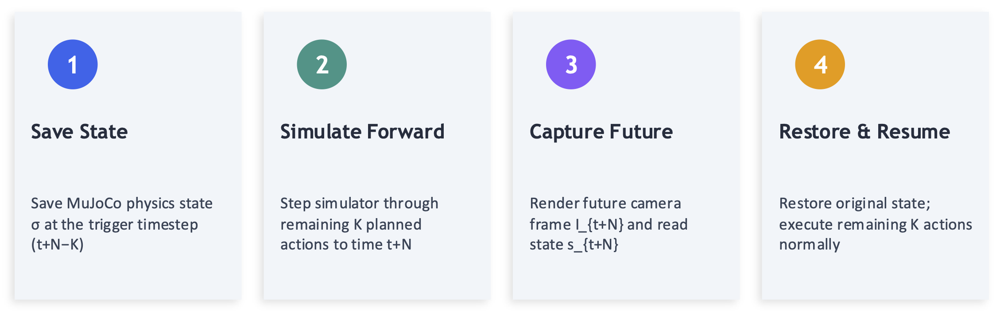

# Introduction

Vision-language-action (VLA) policies used for controlling robots are typically deployed with synchronous execution. If you watch demo videos from papers like <a href="https://arxiv.org/abs/2410.24164">π0</a>, <a href="https://arxiv.org/abs/2504.16054">π0.5</a>, or [OpenVLA](https://arxiv.org/abs/2406.09246), you'll notice that the robot's motion is a series of movements with short pauses in between. Those pauses are the robot running inference — basically thinking about what to do next. While it's thinking, the robot either idles or blindly executes stale commands while the next plan is being computed. That's a problem, especially if anything in the scene is moving.

The obvious fix is **asynchronous inference** — start computing the next action chunk while the robot is still executing the current one. No more idle time. But this creates a sneaky problem: by the time inference finishes, the observation that triggered it is stale. The robot moved during that window, so the new actions are based on where the robot *was*, not where it *is*.

[VLASH](https://arxiv.org/abs/2512.01031) tackles this by rolling forward the robot's proprioceptive state to where it *will* be when the new actions deploy. Sounds reasonable — but it only rolls forward the state, not the image. So the policy gets a current camera frame paired with a future robot state, an input combination it never saw during training. To make this work, VLASH needs a special fine-tuning procedure with temporal offsets baked in. That's doable, but it adds cost and complexity.

This got us thinking: **what if you didn't need to change fine-tuning at all?**

> **Key Insight:** The distribution mismatch in prior approaches arises not from asynchrony itself, but from the *partial* roll-forward. If both the image and state observations are rolled forward to the same future timestep, the policy receives a temporally consistent input that matches its training distribution — eliminating the need for offset-aware fine-tuning.

We tested this idea in three steps. First, we used privileged simulator access in [LIBERO](https://arxiv.org/abs/2306.03310) to render ground-truth future observations and confirmed that an unmodified <a href="https://arxiv.org/abs/2410.24164">π0</a> policy works just as well asynchronously — no re-training needed. Then we swapped out the simulator for the [COSMOS world model](https://arxiv.org/abs/2601.16163), which predicts future frames from planned actions, removing the simulator dependency entirely. Finally, we built a dynamic version of LIBERO where objects move in real time, making inference latency directly hurt performance — exactly the kind of setting where async really matters.

## Contributions

- **More accurate asynchronous inference:** By querying a policy with temporally aligned future $[\text{image, state}]$ observations, DreamActVLA achieves asynchronous inference without any adjustment to the fine-tuning process — a strictly more accurate approach than prior methods like RTC and VLASH that rely on temporally disjoint inputs or offset-aware training.
- **World model generalization:** Using a learned world model (COSMOS) to generate future observations removes the simulator dependency and enables real-robot deployment.
- **Dynamic task benchmark:** A new LIBERO benchmark variant with wall-clock-tied object motion where asynchronous methods offer a clear advantage.

---

# How we Implemented our approach

## Privileged Future Observations

Let $o_t = (I_t, s_t)$ denote the full observation at timestep $t$, where $I_t \in \mathbb{R}^{H \times W \times 3}$ is the rendered camera frame and $s_t \in \mathbb{R}^{8}$ is the proprioceptive state vector (end-effector position, axis-angle orientation, and gripper aperture).

Given a current action chunk $a = [a_t, \ldots, a_{t+N-1}]$ of length $N$, we trigger asynchronous inference $K$ steps before the chunk ends, at step $t + N - K$.

At the trigger point, rather than using the current (stale) observation, we obtain a future observation $o_{t+N}$ by performing a brief rollout within the simulator:

The four-step privileged rollout procedure. Both the image and state are captured from the same simulated future instant, ensuring temporal alignment.

The next action chunk is then computed as $\pi(o_{t+N})$ and is ready at the chunk boundary $t+N$ when the robot needs it. Because both $I_{t+N}$ and $s_{t+N}$ are drawn from the same simulated future instant, the observation pair is **temporally aligned** — it lies on the same distribution as the training data.

<strong>Why this is more accurate:</strong> Training data always pairs contemporaneous images and states. Prior approaches like VLASH break this pairing by only rolling forward the state, producing out-of-distribution inputs. DreamActVLA preserves the original pairing by aligning both modalities to the same future instant — no modified fine-tuning needed.

## World Model Generalization

Of course, the privileged rollout trick only works when you have a simulator to peek into. On a real robot, there's no MuJoCo state to save and restore. So instead, we use the [COSMOS world model](https://arxiv.org/abs/2601.16163) to *imagine* what the future frame will look like, given the planned actions and rolled-forward state. This drops the simulator dependency entirely and opens the door to real-robot deployment.

---

# Does Our Approach Actually Work?

## Experimental Setup

We evaluate on the [LIBERO benchmark (Liu et al., 2023)](https://arxiv.org/abs/2306.03310), which comprises multiple manipulation task suites. Each condition is evaluated over **50 rollouts per task**. All conditions use the <a href="https://arxiv.org/abs/2410.24164">π0-LIBERO checkpoint (Black et al., 2026)</a> without any modification to weights or fine-tuning procedure.

Key parameters:
- **Chunk length:** $N = 15$ actions
- **Overlap:** $K = 10$ steps for the asynchronous condition
- **Inference window:** $K/f = 0.5\text{s}$ at the LIBERO control frequency of $f = 20\text{ Hz}$
- **Hardware:** NVIDIA RTX 4070 GPU (measured inference latency $\tau \approx 120\text{ ms}$)

Critically, the same chunk length $N$ is used for the synchronous baseline, so differences in success rate and completion time reflect the inference strategy alone.

**Time to success** is computed as:

$$T = N_{\text{steps}} / f + T_{\text{block}}$$

where $T_{\text{block}}$ is the total execution time lost to blocking inference pauses (zero for DreamActVLA when inference completes within the overlap window).

## Main Results

| Method | Spatial | Object | Goal | L-10 | Avg SR (%) | Steps | Time (s) | ΔSR | Speedup |
|--------|---------|--------|------|------|-----------|-------|----------|-----|---------|
| Sync (Baseline) | 92.6 | 99.2 | 95.6 | 86.6 | **93.5** | 153.1 | 9.02 | — | — |
| **DreamActVLA (Ours)** | 91.4 | 98.2 | 95.0 | 84.8 | **92.5** | 152.2 | **7.61** | −1.0% | **1.17×** |
| Future-State Only | 12.8 | 26.6 | 52.4 | 19.2 | 27.6 | 228.8 | 11.35 | −65.9% | −25.8% |

DreamActVLA maintains **92.5% success rate** (only a 1% reduction relative to Sync) while reducing mean task completion time to **7.61 s** — a **1.17× speedup**. This speedup stems directly from eliminating blocking inference pauses: inference runs concurrently with the final $K=10$ steps of each chunk and, at a measured latency of $\tau \approx 120\text{ ms}$, completes well within the available $K/f = 500\text{ ms}$ window.

## Future-State-Only Ablation

We also tested a **future-state-only** condition — rolling forward just the state while keeping the current camera image. This is essentially what VLASH does at inference time, but applied to a stock π0 checkpoint without any offset fine-tuning. Look at the last row in the table above.

Here the Task Success Rate falls to **27.6%** — a 65.9% drop. The policy simply can't handle the mismatched input. This is exactly the failure mode that motivated DreamActVLA: if you're going to roll forward, roll forward *everything*. Align both modalities and the policy doesn't even notice it's running asynchronously.

<strong>Note:</strong> The future-state-only result mirrors the observation pair used by VLASH at inference time, but applied to a standard π0-LIBERO checkpoint without temporal offset fine-tuning. VLASH's fine-tuning procedure is specifically designed to handle this disjoint input — but at the cost of additional training complexity.

---

# Discussion

## Limitations

<!-- TODO: Add discussion of limitations -->

---

# Conclusion

We have shown that **temporally aligned future observations** enable more accurate asynchronous inference for VLA policies without any modification to the fine-tuning procedure. By rolling forward both the image and proprioceptive state to the same future timestep, DreamActVLA keeps policy inputs in-distribution and achieves a 1.17× speedup with negligible impact on task success — a strictly more accurate approach than existing methods like RTC and VLASH.

Our approach opens two directions for future work: (1) deploying DreamActVLA on physical robots using learned world models such as COSMOS, and (2) extending the dynamic task benchmark to evaluate robustness under varying object velocities and more complex scene dynamics.
